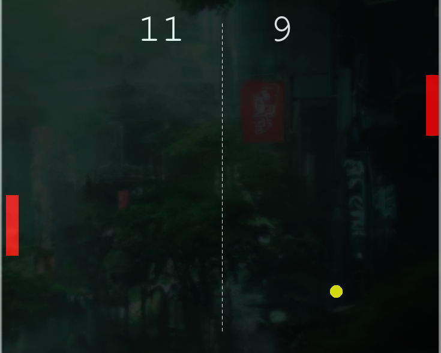

# Pong Game 🏓

A modern Python rendition of the classic arcade game Pong, built with the Turtle Graphics library. Challenge a friend to a fun-filled, competitive gameplay experience!

## Features
- **Two-player mode**: Control the paddles using keyboard keys.
- **Simple mechanics**: Hit the ball back and forth to score.
- **Score tracking**: Real-time display of player scores.
- **Customizable speed**: Adjust game difficulty by modifying the ball's speed.
- **Retro aesthetics**: Experience the charm of an old-school arcade game.

## Screenshot

## How to Play
1. Player 1: Use the **W** and **S** keys to move the left paddle up and down.
2. Player 2: Use the **Up Arrow** and **Down Arrow** keys to control the right paddle.
3. Hit the ball past your opponent's paddle to score a point.
